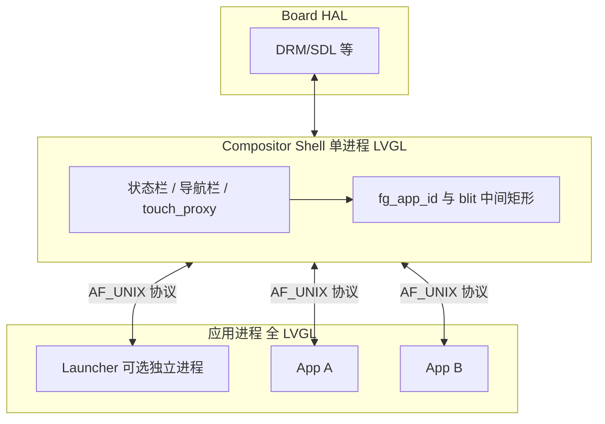

# Shell 平台层（Compositor / IPC / App SDK）说明

面向 Linux 嵌入式、**Compositor 为纯 LVGL 进程**、多应用进程 + 统一 Runtime 协议。  
`Board HAL` 由板级或 SDL 等提供，此处不展开。

**更深入专题（合成 / 触摸 / 按键 / touch_proxy / viewport / 共享内存安全）见：**  
[`COMPOSITOR_INPUT_AND_SECURITY.md`](COMPOSITOR_INPUT_AND_SECURITY.md)

**App 进程 LVGL 缓冲模式（FULL / PARTIAL / DIRECT × 单/双缓冲，0..5）**：`shell_app_runtime/app_display_config.h`，CMake 变量 `APP_LV_DISPLAY_BUFFER_MODE`、`APP_PARTIAL_BUF_LINES`（见根 `CMakeLists.txt`）。原先用 `3` 表示 DIRECT 单缓冲的需改为 `4`。

---

## 1. 三层与你问题的对应关系

| 层 | 职责 |
|----|------|
| **Compositor（Shell 进程）** | 独占显示 HAL；LVGL 绘制状态栏、导航栏、中间区；维护 `fg_app_id`；**仅**将触摸/按键转发给前台；根据 `MSG_APP_PRESENT` 将**前台**应用共享缓冲合成到中间矩形。 |
| **Runtime 协议（IPC）** | 连接建立、surface（memfd）、viewport、前后台、present、输入、Home 等**二进制消息**约定；可版本化。 |
| **App SDK（模板库）** | 封装 connect、register、收 surface、创建 LVGL display、flush→共享内存、发 PRESENT、处理 SET_FOREGROUND / VIEWPORT / INPUT。 |

参考协议演进草案：`spec/runtime_protocol_v1.h`（与现有 `shell_app_runtime/protocol.h` 对齐，增加 magic/version/hello）。

---

## 2. Launcher 是否做成「特殊应用」？

可以，产品上有两种常见模式：

### 模式 A：Launcher 独立进程（你描述的方式）

- **Shell**：只做合成 + 系统 UI + 输入路由，**中间区永远是一块「当前前台」的像素缓冲**（来自 launcher 或某 App）。
- **Launcher 进程**：也是 LVGL + 同一套 App SDK；`app_id = 0`（或保留 ID）；开机第一个被置为前台；负责列出应用、发起「请 Shell 切前台并拉起某 App」的请求（协议里增加 `MSG_SHELL_REQUEST_FOREGROUND` 等）。
- **Home**：Shell 将 `fg_app_id` 设回 Launcher，向旧前台发 `SET_FOREGROUND=0`，向 Launcher 发 `SET_FOREGROUND=1`，并对 Launcher 的 surface 做 `blit`。
- **优点**：Launcher 可独立升级/崩溃隔离；**职责清晰**：「管理应用」的代码不在 Shell 里堆成一团。
- **代价**：多一个进程、多一条连接；Shell 要能区分 **系统应用（launcher）与普通 app**（权限、谁能发「切前台」）。

### 模式 B：Launcher 仍在 Shell 进程内（LVGL 一屏多对象）

- 中间区就是 `lv_obj` 列表 + 启动按钮，**无独立 launcher 进程**。
- **优点**：实现简单、少 IPC。
- **缺点**：「应用管理」逻辑和合成器耦合，长期维护容易臃肿。

**建议**：若明确「Launcher 管理其他应用」且要长期产品化，**模式 A 更干净**；Shell 保持「纯合成 + 系统条」，策略表（谁可启动谁）可放在 Shell 或独立 policy 配置。

---

## 3. Compositor 里纯 LVGL：合成与输入如何实现？

### 3.1 屏幕合成（仅显示前台）

1. **每个应用（含 Launcher）**各自 `memfd`（或 dma-buf）映射到 Shell 地址空间；Shell 维护 `app_id → surface`。
2. **`fg_app_id`** 由 Shell 唯一更新（用户点图标、Home、策略服务）。
3. 收到 **`MSG_APP_PRESENT`**：若 `msg.app_id == fg_app_id`，则 **`memcpy`/RGA/GL blit** 从该 surface 的 dirty 矩形拷到 **SDL/DRM 的 backbuffer** 中与 viewport 对齐的区域；否则可丢弃或仅计调试计数。
4. Shell 自身 LVGL 在 **同一 framebuffer** 上画状态栏、导航栏；**注意重绘顺序**：先画壳，再 blit 中间区；或壳画完后中间区被壳的 REFR 盖住时，在 **`LV_EVENT_REFR_READY`** 里再 blit 一次前台（你们现有做法）。

**中间区不是「再开一个 LVGL display」**，而是 **一块 CPU/GPU 目标矩形**；只有 **前台** 的像素被拷进去。

### 3.2 触摸 / 按键分发

1. HAL 把触摸坐标报到 **Shell 进程**（SDL 鼠标、evdev 等）。
2. Shell 用 **全屏或仅 viewport 上的透明 `lv_obj`（touch_proxy）** 接事件，在回调里判断：
   - 若点击落在 **状态栏/导航栏** 区域 → **本地 LVGL 处理**（不转发）。
   - 若落在 **中间区** → 坐标减去 `(vp_x, vp_y)`，封装 **`MSG_SHELL_INPUT_POINTER`** 发到 **前台 app 的 socket**。
3. 物理 **Home/Back**：可由 Shell 直接处理（进 Launcher），或先转发再给 Shell 快捷键处理，按产品统一一种即可。

---

## 4. LVGL 层级：要不要 TOP /「活动层」？

LVGL 9 常用做法（与「层」字面意思略有不同）：

| 区域 | 建议 |
|------|------|
| **根屏幕** | `lv_scr_act()` 上一个全屏 `root`，子对象：状态栏、**中间宿主 `content_host`**、导航栏。 |
| **中间宿主** | 与状态栏/导航栏 **兄弟关系 + 明确 y 顺序**（上中下），不必用「活动层」术语；中间区底下可放纯色底，避免未合成时花屏。 |
| **`lv_layer_top()`** | 仅放 **临时全局遮罩**（音量条、系统弹窗），不要常驻业务 UI。 |
| **touch_proxy** | 盖在 **viewport 之上**、在 launcher 列表之上（应用模式时），保证触摸先被 Shell 截获再转发；Launcher 模式可隐藏 proxy，让点击落在 launcher 的 LVGL 控件上（若 Launcher 在 Shell 内）或仍通过 proxy 转发给 Launcher 进程（若 Launcher 独立）。 |

**结论**：状态栏/导航栏用 **正常树形 + 顺序布局** 即可；**不必**把「中间区」放到与 TOP 对等的抽象层；关键是 **touch_proxy 与中间内容的 z-order 和可见性**。

---

## 5. Runtime 协议怎么定？Linux 上一般用什么 IPC？

### 5.1 推荐（嵌入式最常见）

- **AF_UNIX + SOCK_STREAM**（你们已在用）：字节流上再包 **定长或「头 + 负载」** 帧。
- **首条消息带 memfd**：`sendmsg(..., SCM_RIGHTS)` 传递 surface fd（你们已有 `ipc_send_msg_with_fd` 一类能力）。
- **优点**：依赖少、延迟低、易 C 实现、易抓包（`strace`）、防火墙无关。

### 5.2 可选

- **DBus**：适合与系统服务集成，消息复杂；对高频 PRESENT 不友好，一般不用DBus传每帧。
- **共享内存 + 信号量**：可配合 socket 只传「第几帧 ready」；大块像素仍走 memfd/shm。
- **eBPF / io_uring**：偏优化，非协议必选。

### 5.3 协议内容建议（与 `spec/runtime_protocol_v1.h` 一致方向）

1. **版本**：`magic + ver_major + ver_minor`；不兼容则拒绝连接。
2. **角色**：`HELLO` 里声明 APP / LAUNCHER。
3. **消息类型**：REGISTER → SURFACE（附 fd）→ VIEWPORT_UPDATE → SET_FOREGROUND → PRESENT / INPUT / GO_HOME / NAV_REQ …
4. **幂等与顺序**：`seq` 递增，便于日志与乱序检测。
5. **扩展**：新字段只 **追加** 或走新 `type`，保持旧客户端可运行或明确失败。

---

## 6. 与当前仓库的关系

- 运行实现见：`shell_app_runtime/`（`shell_runtime.c`、`app_runtime.c`、`protocol.h`、`ipc.c`）。
- `shell_platform/` 为 **产品与协议演进** 的说明与参考头，**默认不参与编译**；定稿后可合并进 `shell_app_runtime/protocol.h` 并逐步在 Shell/App 中校验 `magic/version`。

---

## 7. 简图（逻辑）

如需下一步：可把 `MSG_SHELL_REQUEST_FOREGROUND`、Launcher `app_id` 规则写进 `protocol.h` 并拆 `launcher_main` 二进制，与现有 `app_runtime` 并列构建。
